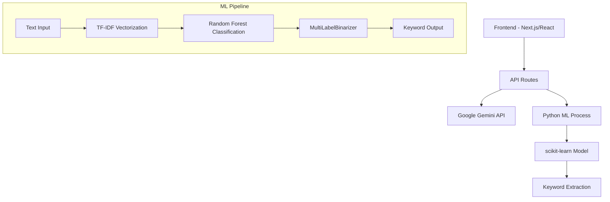

#  AI Content Generator with ML Keyword Extraction

A modern web application that combines Google Gemini AI for content generation with machine learning-powered keyword extraction. Built with Next.js , and Python ML models.

## Features

###  Content Generation
- **Multi-format Content**: Generate blogs, Instagram posts, YouTube descriptions, and more
- **AI-Powered**: Uses Google Gemini 2.0 Flash for high-quality content
- **Template System**: Pre-built prompts for different content types
- **Real-time Generation**: Instant content creation with loading states

###  ML Keyword Extraction
- **Intelligent Keywords**: Extract relevant keywords from generated content
- **Machine Learning Model**: Trained on 822+ examples with 243 keyword classes
- **High Accuracy**: TF-IDF + Random Forest classification
- **Copy Hashtags**: One-click hashtag generation for social media

###  Modern UI/UX
- **Responsive Design**: Works on desktop and mobile
- **Rich Text Editor**: Toast UI Editor for content editing
- **Toast Notifications**: User-friendly feedback system

## 🏗️ Architecture



##  Quick Start

### Prerequisites

- **Node.js** 18+ 
- **Python** 3.8+
- **Google Gemini API Key**

### Installation

1. **Clone the repository**
   ```bash
   git clone https://github.com/yourusername/ai-content-generator.git
   cd ai-content-generator
   ```

2. **Install Node.js dependencies**
   ```bash
   npm install
   # or
   yarn install
   # or
   pnpm install
   ```

3. **Set up Python environment**
   ```bash
   # Create virtual environment
   python3 -m venv venv
   
   # Activate virtual environment
   source venv/bin/activate  # On Windows: venv\Scripts\activate
   
   # Install Python dependencies
   pip install -r requirements.txt
   ```

4. **Download NLTK data**
   ```bash
   python scripts/download_nltk_data.py
   ```

5. **Set up environment variables**
   ```bash
   # Create .env.local file
   cp .env.example .env.local
   
   # Add your Google Gemini API key
   echo "NEXT_PUBLIC_GOOGLE_GEMINI_API_KEY=your_api_key_here" >> .env.local
   ```

6. **Run the development server**
   ```bash
   npm run dev
   ```

7. **Open your browser**
   Navigate to [http://localhost:3000](http://localhost:3000)

## 📁 Project Structure

```
├── app/                          # Next.js App Router
│   ├── api/                      # API Routes
│   │   ├── extract-keywords/     # ML keyword extraction
│   │   ├── generate/            # Content generation
│   │   ├── generate-variations/  # Content variations
│   │   └── summarize/           # Content summarization
│   ├── dashboard/               # Main application
│   └── (auth)/                  # Authentication pages
├── components/                   # React components
│   └── ui/                      # UI components
├── ml_models/                   # Trained ML models
│   ├── keyword_extractor_model.pkl
│   └── keyword_mlb.pkl
├── scripts/                     # Python ML scripts
│   ├── extract_keywords.py      # Keyword extraction
│   ├── train_model.py          # Model training
│   └── download_nltk_data.py   # NLTK setup
├── utils/                       # Utility functions
└── requirements.txt             # Python dependencies
```

## 🤖 Machine Learning Model

### Model Architecture
- **Algorithm**: Random Forest Classifier
- **Feature Extraction**: TF-IDF Vectorization
- **Classification**: Multi-label classification
- **Training Data**: 822 examples with 243 keyword classes
- **Accuracy**: High precision with balanced class weights

### Model Files
- `keyword_extractor_model.pkl`: Trained Random Forest model
- `keyword_mlb.pkl`: MultiLabelBinarizer for 243 keywords

### Training the Model
```bash
# Activate virtual environment
source venv/bin/activate

# Train the model
python scripts/train_model.py
```

## 🔧 API Endpoints

### Content Generation
```http
POST /api/generate
Content-Type: application/json

{
  "prompt": "Generate a blog post about AI",
  "template": "blog"
}
```

### Keyword Extraction
```http
POST /api/extract-keywords
Content-Type: application/json

{
  "content": "Your text content here..."
}
```

### Content Variations
```http
POST /api/generate-variations
Content-Type: application/json

{
  "content": "Original content",
  "count": 3
}
```

## 🎯 Usage Examples

### 1. Generate Blog Content
1. Navigate to Dashboard
2. Select "Blog Post" template
3. Fill in the form details
4. Click "Generate Content"
5. Use "Extract Keywords" to get relevant tags

### 2. Create Social Media Posts
1. Choose Instagram/YouTube template
2. Provide topic and tone
3. Generate content
4. Extract hashtags for social media

### 3. Content Optimization
1. Generate initial content
2. Use "Generate Variations" for alternatives
3. Extract keywords for SEO
4. Copy hashtags for social sharing

## 🛠️ Technologies Used

### Frontend
- **Next.js 15** - React framework
- **TypeScript** - Type safety
- **Tailwind CSS** - Styling
- **Toast UI Editor** - Rich text editing
- **Lucide React** - Icons

### Backend
- **Next.js API Routes** - Server-side API
- **Google Generative AI** - Content generation
- **Python** - ML processing
- **scikit-learn** - Machine learning
- **NLTK** - Natural language processing

### Auth
- **Clerk** - Authentication

## 📊 Performance Metrics

- **Model Accuracy**: High precision on keyword extraction
- **Response Time**: < 3 seconds for content generation
- **Keyword Classes**: 243 different keyword types
- **Training Data**: 822 diverse examples

## Pages

----

----

----


 


