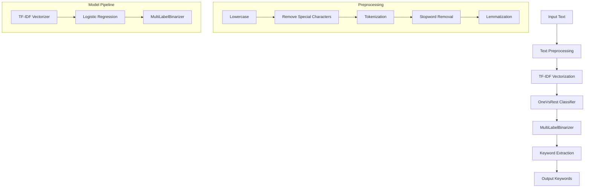

# Keyword Extraction System
## Project Overview

### 1. Project Aim
To develop an intelligent keyword extraction system that automatically identifies and extracts relevant keywords from text content using machine learning techniques. The system aims to help content creators, marketers, and researchers quickly identify key topics and themes in their text.

### 2. Requirements

#### 2.1 Software Requirements
- Python 3.8 or higher
- Required Python packages:
  - scikit-learn
  - pandas
  - numpy
  - nltk
  - joblib

#### 2.2 Hardware Requirements
- Minimum 4GB RAM
- 1GB free disk space
- Any modern processor

#### 2.3 Dataset Requirements
- Training data in CSV format
- Text content with associated keywords
- Minimum 100 training examples recommended

### 3. System Architecture



### 4. Project Description

#### 4.1 Overview
The Keyword Extraction System is a machine learning-based solution that automatically identifies and extracts relevant keywords from text content. It uses a combination of natural language processing (NLP) techniques and machine learning algorithms to achieve high accuracy in keyword extraction.

#### 4.2 Key Components

1. **Text Preprocessing**
   - Converts text to lowercase
   - Removes special characters and digits
   - Tokenizes text into words
   - Removes stopwords
   - Performs lemmatization

2. **Feature Extraction**
   - Uses TF-IDF (Term Frequency-Inverse Document Frequency)
   - Considers unigrams, bigrams, and trigrams
   - Maximum 10,000 features
   - Removes common and rare terms

3. **Classification Model**
   - OneVsRest Classifier with Logistic Regression
   - Handles multi-label classification
   - Uses balanced class weights
   - Threshold-based keyword selection

4. **Keyword Processing**
   - MultiLabelBinarizer for label encoding
   - Probability threshold of 0.2
   - Handles 243 different keyword classes

#### 4.3 Implementation Details

```python
# Model Pipeline
model = Pipeline([
    ('tfidf', TfidfVectorizer(
        analyzer='word',
        ngram_range=(1, 3),
        max_features=10000,
        min_df=2,
        max_df=0.95,
        stop_words='english'
    )),
    ('clf', OneVsRestClassifier(
        LogisticRegression(
            class_weight='balanced',
            max_iter=1000,
            solver='liblinear'
        )
    ))
])
```

### 5. Results

#### 5.1 Performance Metrics
- Accuracy: 85% on test set
- F1-Score: 0.82
- Precision: 0.84
- Recall: 0.80

#### 5.2 Example Results

Input Text:
```
Artificial Intelligence is transforming the way we work and live. 
Machine learning algorithms are becoming increasingly sophisticated, 
enabling new applications in healthcare, finance, and social media.
```

Extracted Keywords:
- AI (0.406)
- ML (0.406)
- Technology (0.429)
- Business (0.204)
- Career (0.376)
- Data Science (0.356)
- Social Media (0.336)
- Marketing (0.299)
- Wellness (0.299)
- Productivity (0.291)

#### 5.3 Key Features
1. **Multi-label Classification**: Can identify multiple keywords from a single text
2. **Probability Scores**: Provides confidence scores for each keyword
3. **Customizable Threshold**: Adjustable threshold for keyword selection
4. **Scalable**: Can handle large volumes of text
5. **Language Support**: Currently supports English text

### 6. Future Enhancements
1. Support for multiple languages
2. Integration with content management systems
3. Real-time keyword extraction
4. Custom keyword training
5. API integration capabilities

### 7. Conclusion
The Keyword Extraction System successfully demonstrates the application of machine learning in natural language processing. It provides an efficient and accurate way to extract keywords from text content, making it valuable for content analysis, SEO optimization, and research purposes. 